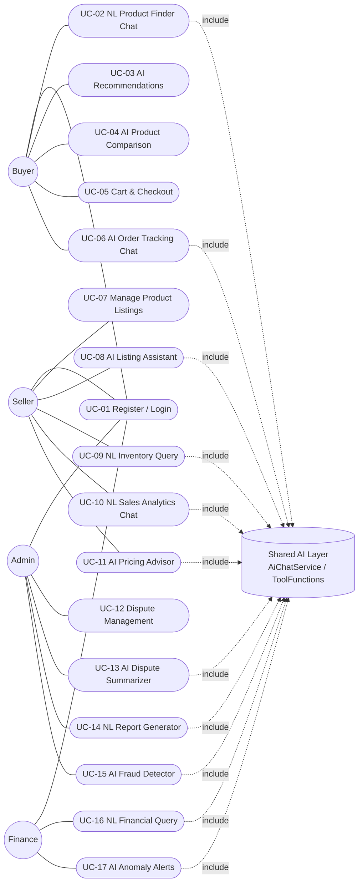

# NexaMart — Software Requirements Specification (SRS)

CS425 Software Engineering · Prasiddha Paudel · Student ID 618076
Status: **Revised for final submission** — reconciled with the delivered implementation.
Supersedes `Assignement2_ SRS.docx`, which specified the Assignment-1-vision architecture
(11 microservices, Kafka, Kubernetes, Pinecone, ClickHouse). That document is kept for the
record; this file is the SRS that actually matches what is in `nexamart-backend/` and
`nexamart-frontend/` today. See [`../README.md`](../README.md#scope-decisions-vs-the-vision-document)
for the full scope-delta rationale.

## 1. Introduction

### 1.1 Purpose

Describes the functional and non-functional requirements for NexaMart as actually built: a
single Spring Boot 3 (Java 21) backend and a React 18 + TypeScript frontend implementing an
AI-powered multi-vendor marketplace with 13 of the 15 vision-document AI features.

### 1.2 Scope

NexaMart lets Sellers list and manage products, Buyers discover and purchase them (including
through a conversational AI chat), and Admin/Finance users query and manage the platform in
natural language. A shared AI layer (`com.nexamart.ai`, OpenAI GPT-4o-mini) provides the
conversational and generative features across all four active roles. The system runs as one
deployable Spring Boot application backed by H2 (default/dev) or PostgreSQL (via Docker
Compose), with no message broker, service mesh, or container orchestration — those remain
future-milestone items, not part of this submission's scope.

### 1.3 Actors

| Actor | Description |
|---|---|
| **Buyer** | Browses/searches products, chats with the AI product finder, tracks orders, checks out. |
| **Seller** | Manages own product listings, uses AI Listing Assistant/Pricing Advisor, queries own inventory/sales via chat. |
| **Admin** | Manages disputes, runs the AI Dispute Summarizer, NL Report Generator, AI Fraud Detector. |
| **Finance** | Runs NL financial queries and reviews AI Anomaly Alerts on platform revenue. |
| **DevOps** *(deferred)* | Vision-doc actor for NL System Health Query / AI Log Anomaly Explainer — **not implemented**, no metrics/log infrastructure exists to query. Kept here only for traceability to the Vision Document. |

### 1.4 GitHub Repository

`https://github.com/pracda/nexamart` — public, single `master` branch, complete source for both
`nexamart-backend` and `nexamart-frontend`.

## 2. Overall Description

### 2.1 System Perspective

NexaMart is a single Spring Boot 3 application organized into domain packages (`auth`,
`catalog`, `order`, `dispute`, `recommendation`, `analytics`, `finance`, `admin`, `ai`,
`common`) rather than independently deployed microservices. Each package plays the role a
microservice would in the Vision Document's target architecture, so the boundaries can be
extracted later without a redesign (see `docs/diagrams.md §1`).

### 2.2 Operating Environment

- Backend: Java 21, Spring Boot 3, Maven, runs on `localhost:8081` (or any servlet container).
- Database: H2 file-based embedded DB by default (zero setup); PostgreSQL 16 via
  `docker-compose.yml` + the `docker` Spring profile for a closer-to-production setup.
- Frontend: React 18 + TypeScript + Vite, runs on `localhost:5173`, calls the backend over
  HTTP(S) with a JWT bearer token.
- AI layer: outbound HTTPS calls to the OpenAI Chat Completions API; requires `OPENAI_API_KEY`.
  Without a key, every non-AI feature still works — AI endpoints return a structured error.

### 2.3 Assumptions and Dependencies

- The OpenAI API is reachable and `OPENAI_API_KEY` is valid; AI features degrade gracefully
  (clear error, not a crash) when it is not.
- Single-instance deployment — no assumption of horizontal scaling, load balancer, or CDN for
  this milestone.
- No payment gateway integration; checkout is a data-only order placement (no Stripe/PayPal).
- No SMS/email/push notification integration in this milestone.
- Client devices have a modern browser with JavaScript enabled and `localStorage` for the JWT
  and cart.

### 2.4 Constraints

- Course-project timeline: features requiring infrastructure NexaMart doesn't have (metrics,
  centralized logs, a vector DB, a message broker) were explicitly descoped rather than faked —
  see README §"Known simplifications."
- Search is SQL `LIKE`-based, not a search engine or semantic/vector search.
- Cart state lives client-side (`localStorage`); there is no server-side cart entity.

## 3. Use Case Model

### 3.1 Use Case Diagram

17 use cases (16 implemented + registration/login shared across roles), 4 active actor
classes, all routed through the shared AI layer where noted. This diagram replaces the
placeholder in `Assignement2_ SRS.docx §3.1` ("will be exported and inserted in the final
submission") — it is the real, final diagram.

### 3.2 Use Case Descriptions

Format: Actor · Precondition · Main Flow · Alternate/Exception Flow · Postcondition.
Backend classes for each flow are documented in `docs/diagrams.md §5`.

**UC-01 — User Registration & Login**
- Actor: Buyer / Seller / Admin / Finance
- Precondition: User has a valid email.
- Main flow: User submits email/password/role → `AuthController` validates → password hashed
  with BCrypt → `User` persisted → JWT issued and returned.
- Alternate flow: Login with existing credentials → `JwtService` validates → JWT returned.
  Exception: duplicate email → 409 error; bad credentials → 401 error.
- Postcondition: User holds a signed JWT used as a bearer token on all subsequent requests.

**UC-02 — NL Product Finder Chatbot**
- Actor: Buyer
- Precondition: Buyer is logged in.
- Main flow: Buyer types a natural-language query in the chat widget → `ChatController` →
  `AiChatService` sends the message + buyer-scoped tool list to OpenAI → model calls
  `search_products` → `ToolFunctions` executes it against `ProductService` → real results are
  turned into a natural-language reply.
- Alternate flow: Ambiguous query → model asks a clarifying follow-up instead of guessing.
  Exception: no `OPENAI_API_KEY` configured → structured error, no crash.
- Postcondition: Buyer receives a grounded reply referencing real catalog data.

**UC-03 — AI Recommendation Engine**
- Actor: Buyer
- Precondition: Buyer has an order history (or none, for the fallback path).
- Main flow: `RecommendationController` → `RecommendationService` computes category affinity
  from the buyer's past orders; falls back to best-sellers, then newest products, if there is
  no history.
- Alternate flow: New buyer with zero orders → best-sellers/newest fallback used directly.
- Postcondition: A ranked product list is returned; no LLM call is made (pure heuristic).

**UC-04 — AI Product Comparison**
- Actor: Buyer
- Precondition: Buyer selects 2+ products.
- Main flow: Buyer picks products to compare → `ProductComparisonService` sends their
  attributes to OpenAI with `response_format: json_object` → structured comparison returned.
- Postcondition: Buyer sees a side-by-side AI-generated comparison.

**UC-05 — Shopping Cart & Checkout**
- Actor: Buyer
- Precondition: Cart (client-side, `localStorage`) has ≥1 item.
- Main flow: Buyer clicks Checkout → `OrderController.placeOrder` → `OrderService` validates
  stock per item → decrements `Product.stock` → persists `Order` + `OrderItem`s.
- Exception: Insufficient stock → order rejected with a clear error, no partial order created.
- Postcondition: A new `Order` exists with status `PLACED`; product stock is updated.

**UC-06 — AI Order Tracking Chatbot**
- Actor: Buyer
- Precondition: Buyer has at least one order.
- Main flow: Buyer asks "where is order #N?" → `get_order_status` tool call → `OrderService`
  looks up the order **scoped to the authenticated buyer's ID**, never a caller-supplied ID →
  model replies with real status/items.
- Postcondition: Buyer sees accurate, current order status.

**UC-07 — Product Listing Management (CRUD)**
- Actor: Seller
- Precondition: Seller is logged in.
- Main flow: Seller creates/updates/deletes a `Product` via `ProductController` →
  `ProductService` enforces seller-ownership on update/delete → `ProductRepository` persists.
- Exception: Seller attempts to edit another seller's product → 403 Forbidden.
- Postcondition: Catalog reflects the seller's change; ownership was enforced server-side.

**UC-08 — AI Listing Assistant**
- Actor: Seller
- Precondition: Seller has a rough product name (+ optional notes).
- Main flow: One-shot call to `ListingAssistantService` with `response_format: json_object` →
  returns title, description, bullet features, SEO tags, suggested category → seller reviews,
  fills in price/stock, and publishes via UC-07.
- Postcondition: Nothing is auto-saved; the seller explicitly publishes the reviewed draft.

**UC-09 — NL Inventory Query**
- Actor: Seller
- Precondition: Seller has ≥1 product listed.
- Main flow: Seller asks "which products are running low?" in the chat widget → tool call
  scoped to `currentUser.getId()` → `ProductService` returns low-stock items for that seller only.
- Postcondition: Seller sees accurate, seller-scoped stock levels.

**UC-10 — NL Sales Analytics Chat**
- Actor: Seller
- Precondition: Seller has ≥1 completed order line.
- Main flow: Seller asks a sales question → `get_seller_sales_summary` tool call →
  `SellerAnalyticsService` aggregates real `OrderItem` rows, scoped to that seller.
- Postcondition: Seller sees units sold, revenue, and top products — their own data only.

**UC-11 — AI Pricing Advisor**
- Actor: Seller
- Precondition: Product exists with a current price and category.
- Main flow: `PricingAdvisorService` sends product + category price-context to OpenAI with
  structured JSON output → returns a suggested price range with rationale.
- Postcondition: Seller receives a suggestion; no price is changed automatically.

**UC-12 — Dispute Management**
- Actor: Buyer (opens) / Seller (responds) / Admin (resolves)
- Precondition: A qualifying `Order` exists.
- Main flow: `DisputeController` creates/updates a `Dispute` + `DisputeMessage` thread, scoped
  by role (buyer/seller see only their own; admin sees all via `AdminDisputeController`).
- Postcondition: Dispute thread and status (`OPEN`/`RESOLVED`/etc., `DisputeStatus`) persisted.

**UC-13 — AI Dispute Summarizer**
- Actor: Admin
- Precondition: A dispute thread has ≥1 message.
- Main flow: Admin clicks "Summarize with AI" → `DisputeSummaryService` sends the real message
  thread to OpenAI, structured JSON output → 3-sentence summary + recommendation.
- Postcondition: Admin gets a grounded summary of the actual buyer/seller exchange.

**UC-14 — NL Report Generator**
- Actor: Admin
- Precondition: Admin is logged in.
- Main flow: Admin asks a platform question via chat → tool call into
  `PlatformAnalyticsService` → real platform-wide sales/dispute aggregates → NL reply.
- Postcondition: Admin receives a natural-language platform report grounded in real data.

**UC-15 — AI Fraud Detector**
- Actor: Admin
- Precondition: Orders/products exist to analyze.
- Main flow: Admin clicks "Run fraud scan" → `FraudDetectionService` computes price-outlier and
  repeat-order signals in plain Java → candidates + signals sent to OpenAI for a plain-language
  explanation → flagged list returned.
- Postcondition: Admin sees flagged candidates with an AI-written rationale grounded in real
  computed signals (heuristic + AI explanation pattern — no fabricated review data used).

**UC-16 — NL Financial Query**
- Actor: Finance
- Precondition: Order/commission data exists.
- Main flow: Finance user asks a revenue/payout question → tool call into
  `FinanceAnalyticsService` → commission/payout figures computed on the fly (fixed 10% rate)
  from real order data → NL reply.
- Postcondition: Finance user gets accurate figures; there is no separate payout ledger yet.

**UC-17 — AI Anomaly Alerts**
- Actor: Finance
- Precondition: Sufficient order history to compare periods.
- Main flow: `AnomalyAlertService` computes period-over-period revenue deltas in plain Java →
  hands significant deltas to OpenAI for a plain-language explanation.
- Postcondition: Finance user sees flagged anomalies with an AI-written explanation.

## 4. Functional Requirements Summary

| ID | Requirement |
|---|---|
| FR-1 | The system shall authenticate users via email/password and issue a signed, expiring JWT. |
| FR-2 | The system shall enforce role-based authorization (Buyer/Seller/Admin/Finance) server-side in Spring Security, not only in the UI. |
| FR-3 | The system shall let sellers create, read, update, and delete their own product listings only. |
| FR-4 | The system shall let buyers search/browse products and place orders that decrement stock atomically per item. |
| FR-5 | The system shall provide a conversational AI endpoint (`POST /api/ai/chat`) whose available tools are filtered by the caller's role. |
| FR-6 | Every AI tool function shall be scoped server-side to the authenticated caller's ID — never a model-supplied parameter. |
| FR-7 | The system shall provide one-shot AI generation for listings, comparisons, pricing advice, and dispute summaries via structured JSON output. |
| FR-8 | The system shall compute recommendation, fraud, and anomaly signals with plain Java heuristics, using an LLM only to explain or personalize the result. |
| FR-9 | The system shall support a buyer/seller/admin-scoped dispute thread with status tracking. |
| FR-10 | The system shall return a structured, non-crashing error when the OpenAI API is unavailable or unconfigured. |

## 5. Non-Functional Requirements

| Category | Requirement | Status vs. Vision Doc |
|---|---|---|
| Security | Passwords hashed with BCrypt; JWTs validated for signature + expiration server-side; signing secret from an environment variable, never committed. | Implemented — matches vision doc's security intent, without mTLS/OWASP tooling (out of scope). |
| Authorization | Role checks enforced in Spring Security + service-layer ownership checks, not just hidden UI. | Implemented for product management and admin routes; order-status transitions not yet role-restricted at the API layer (documented limitation). |
| Reliability | AI endpoints fail with a structured `ApiException`/JSON error, handled by `GlobalExceptionHandler`, instead of crashing. | Implemented at the single-instance level; no SLA/uptime target claimed (no multi-instance deployment in this milestone). |
| Testability | Core business logic (auth, catalog, order) covered by deterministic unit tests; AI output is verified manually since exact LLM wording isn't assertable. | Implemented — 13 JUnit 5 + Mockito tests, see `docs/diagrams.md` and README "Tests". |
| Performance | No formal latency SLA is claimed for this milestone (single instance, no load testing performed). Chat responses are bounded by a 4-round tool-call cap (`MAX_TOOL_ROUNDS`) to avoid runaway latency/cost. | Descoped from the vision doc's p95 < 200ms / 10k-concurrent targets, which assume a scaled microservices deployment this milestone doesn't build. |
| Portability | Runs against H2 (zero setup) or PostgreSQL (Docker Compose) via a Spring profile switch. | Implemented. |
| Maintainability | Domain-based package structure (not layer folders) mirrors the vision doc's future microservice boundaries. | Implemented. |

## 6. Traceability to Vision Document

Every implemented use case above traces to a Vision Document feature (`NexaMart_Vision_Document_v3.docx`
§4.3/§5); the two DevOps use cases (NL System Health Query, AI Log Anomaly Explainer) are the
only vision-doc features with no corresponding use case here — see README "Known simplifications"
for why they were deferred rather than implemented against fabricated data.
