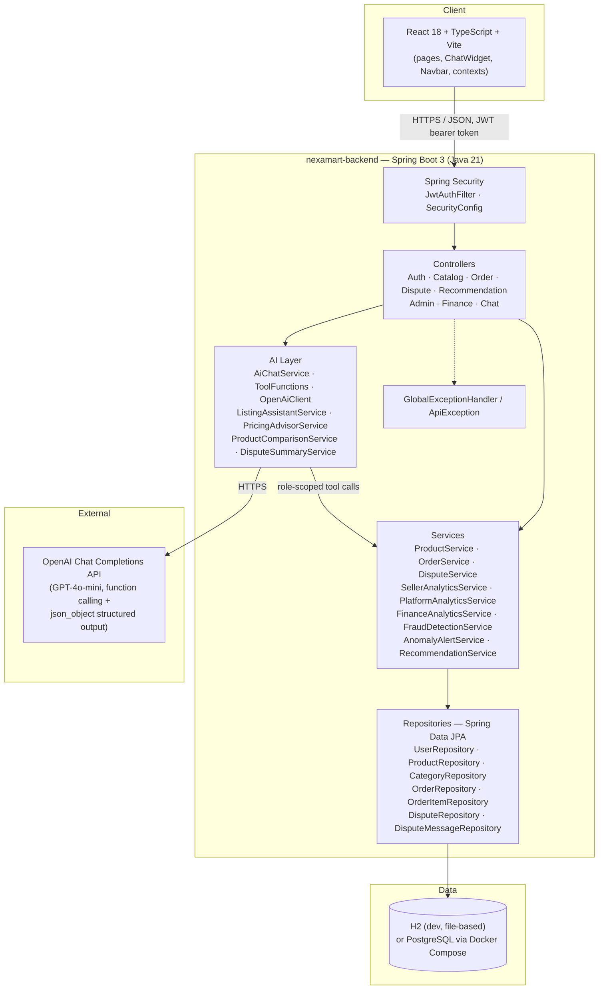
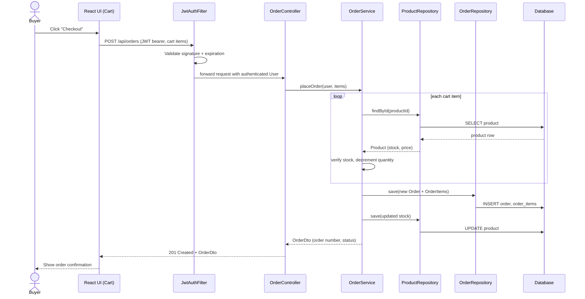
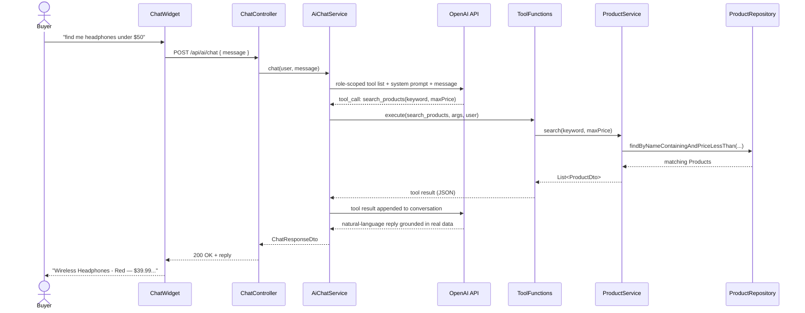
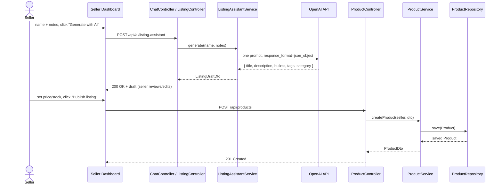
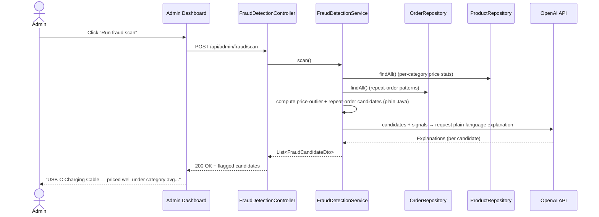
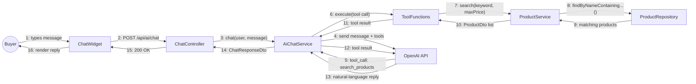
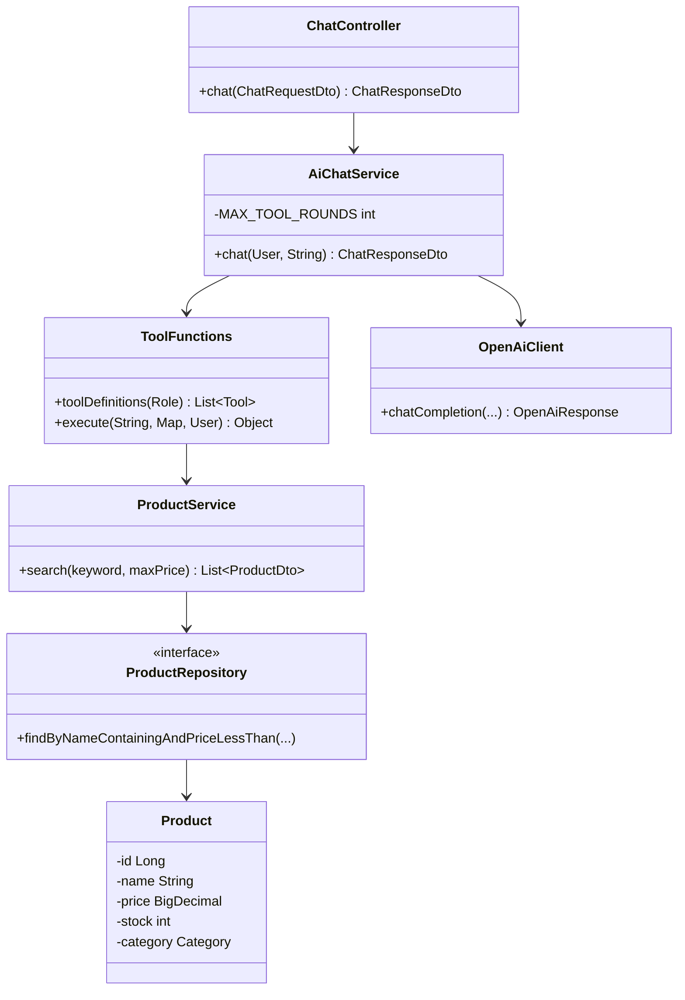
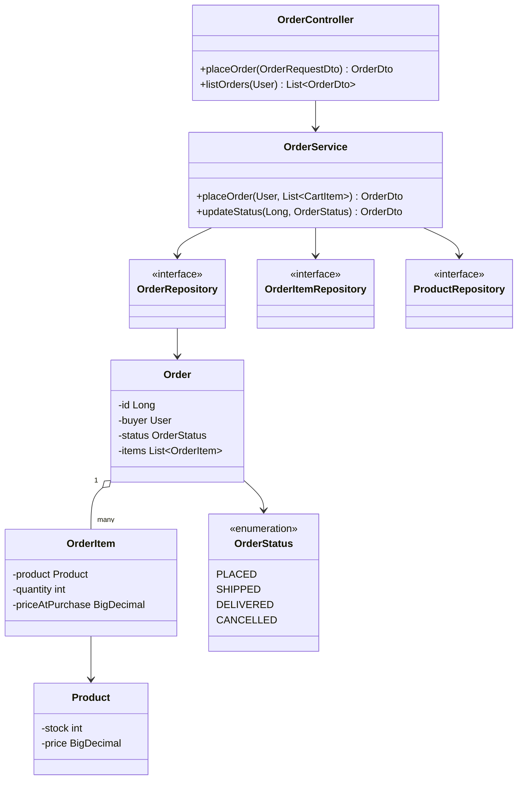

# NexaMart — Architecture & UML Diagrams

This document satisfies the "System architecture, sequence, collaboration, and VOPC diagrams"
submission requirement. All diagrams describe the **actual implemented system** (Spring Boot 3
modular monolith + React 18 frontend), not the aspirational 11-microservice design from the
Vision Document — see [`../README.md#scope-decisions-vs-the-vision-document`](../README.md) for
why that scope was cut for this milestone. Diagrams render natively on GitHub.

## 1. System Architecture

Controllers stay HTTP-only, services hold business logic, repositories are the sole DB access
path (rubric criteria 4–7). Package boundaries (`com.nexamart.auth`, `catalog`, `order`,
`dispute`, `recommendation`, `analytics`, `finance`, `admin`, `ai`, `common`) mirror the domain
boundaries the Vision Document assigns to separate microservices, so the system can be split
apart later without a rewrite.

## 2. Sequence Diagrams

### 2.1 Buyer places an order (core CRUD flow — UC-04 Shopping Cart & Checkout)

### 2.2 Buyer — NL Product Finder Chatbot (function calling — UC-02)

### 2.3 Seller — AI Listing Assistant (one-shot structured generation — UC-03 support)

### 2.4 Admin — AI Fraud Detector (heuristic signal + AI explanation)

## 3. Collaboration Diagram — NL Product Finder Chatbot

A collaboration (communication) view of the same UC-02 interaction as §2.2, showing participating
objects and the order messages travel between them.

## 4. VOPC (View of Participating Classes) Diagrams

### 4.1 UC-02 — NL Product Finder Chatbot

### 4.2 UC-04 — Shopping Cart & Checkout

## 5. Diagram-to-code cross-reference

| Diagram | Backend classes it reflects |
|---|---|
| System Architecture | `com.nexamart.*` package layout — see `nexamart-backend/src/main/java/com/nexamart` |
| 2.1 Checkout sequence | `OrderController`, `OrderService`, `OrderRepository`, `Product`, `ProductRepository` |
| 2.2 Product Finder sequence + Collaboration | `ChatController`, `AiChatService`, `ToolFunctions`, `OpenAiClient`, `ProductService` |
| 2.3 AI Listing Assistant sequence | `ListingAssistantService`, `ProductController`, `ProductService` |
| 2.4 AI Fraud Detector sequence | `FraudDetectionController`, `FraudDetectionService` |
| VOPC 4.1 / 4.2 | as labeled above |

Keep this file in sync if class/package names change before the presentation date.
